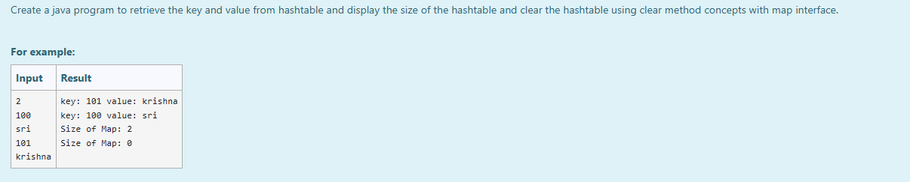
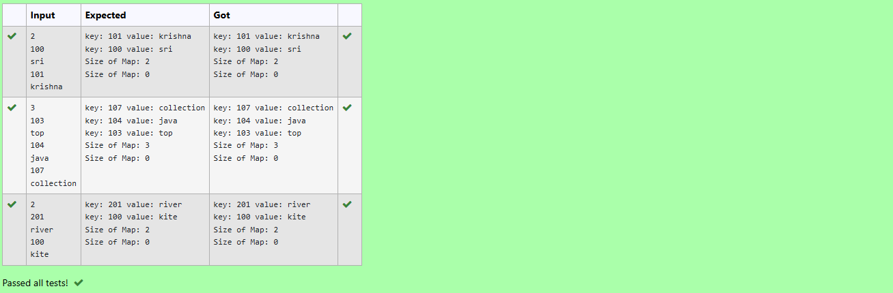

# Ex.No:11(E) JAVA HASHTABLE OPERATIONS

## AIM:
To Create a java program to retrieve the key and value from hashtable and display the size of the hashtable and clear the hashtable using clear method concepts with map interface.

## ALGORITHM :
1. Start the program.
2. Import the `java.util.*` package.
3. Define the `HashTableDemo` class and its `main()` method.
4. Inside the `main()` method:
    - a. Create a `Scanner` object to read input from the user.
    - b. Read an integer `n` from the user, representing the number of key-value pairs to add.
    - c. Create a `Map` object (specifically a `Hashtable<Integer, String>`).
    - d. Use a `for` loop to iterate `n` times:
        i. Read an integer `key` from the user.
        ii. Read a string `value` from the user.
        iii. Add the `key`-`value` pair to the `Hashtable` using `map.put(key, value)`.
    - e. Iterate through the `Hashtable` using a `for-each` loop on `map.entrySet()`:
        i. For each `Entry`, print its key and value.
    - f. Print the current size of the `Hashtable` using `map.size()`.
    - g. Clear all entries from the `Hashtable` using `map.clear()`.
    - h. Print the size of the `Hashtable` again to confirm it's empty.
5. Close the `Scanner` object.
6. End the program.

## PROGRAM:
```
/*
Program to implement a HASHTABLE OPERATIONS
Developed by: Muhammad Afshan A
RegisterNumber: 212223100035
*/
```

## PROGRAM QUESTION AND SAMPLE INPUT:


## SOURCECODE.JAVA:
```
import java.util.*;

public class HashTableDemo {
    public static void main(String[] args) {
        Scanner sc = new Scanner(System.in);
        int n = sc.nextInt();
        Map<Integer, String> map = new Hashtable<>();

        for (int i = 0; i < n; i++) {
            int key = sc.nextInt();
            String value = sc.next();
            map.put(key, value);
        }

        for (Map.Entry<Integer, String> entry : map.entrySet()) {
            System.out.println("key: " + entry.getKey() + " value: " + entry.getValue());
        }

        System.out.println("Size of Map: " + map.size());
        map.clear();
        System.out.println("Size of Map: " + map.size());
        sc.close();
    }
}
```

---

## OUTPUT:


## RESULT:
Thus, the Java program successfully demonstrates `Hashtable` operations by populating it with user-defined key-value pairs, displaying its contents and size, and then clearing the `Hashtable`.