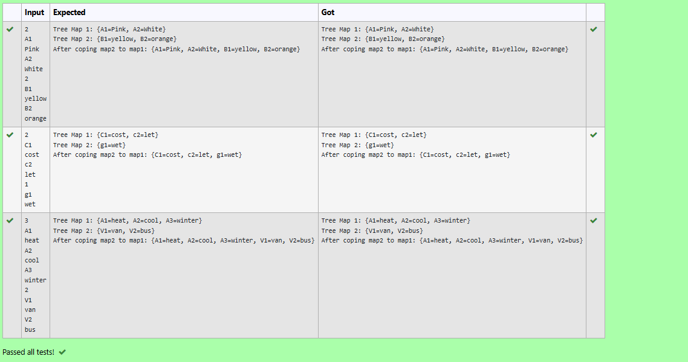

# Ex.No:12(A) JAVA TREE MAP
## AIM:
To create two TreeMap objects, populate them with key-value pairs, and merge the second into the first using putAll().

## ALGORITHM :


1. **Take input `n`** – number of key-value pairs for the first TreeMap (`t1`).
2. **Create and populate `TreeMap<String, String> t1`** using user input.
3. **Take input `n1`** – number of entries for the second TreeMap (`t2`).
4. **Create and populate `TreeMap<String, String> t2`** similarly with key-value pairs.
5. **Use `t1.putAll(t2)`** to merge `t2` into `t1` and display the updated `t1`.

## PROGRAM:
 ```
/*
Program to implement a JAVA TREE MAP using Java
Developed by: Muhammad Afshan A
RegisterNumber: 212223100035*/
```
## SOURCECODE.JAVA:

```
import java.util.*;
public class Demo{
    public static void main(String args[]){
       TreeMap<String,String> t1 = new TreeMap<String, String>();
       Scanner sc= new Scanner(System.in);
       int n = sc.nextInt();
       for(int i =0;i<n;i++){
           String str1 = sc.next();
           String str2 = sc.next();
           t1.put(str1,str2);
       }
       System.out.println("Tree Map 1: "+ t1);
       int n1 = sc.nextInt();
       TreeMap<String,String> t2 = new TreeMap<String,String>();
       for(int i =0;i<n1;i++){
           String str3 = sc.next();
           String str4 = sc.next();
           t2.put(str3,str4);
       }
       System.out.println("Tree Map 2: "+ t2);
       t1.putAll(t2);
       System.out.println("After coping map2 to map1: "+ t1);
    }
}

```

## OUTPUT:


## RESULT:
Thus the Java program To create two TreeMap objects, populate them with key-value pairs, and merge the second into the first using putAll() executed successfully.
