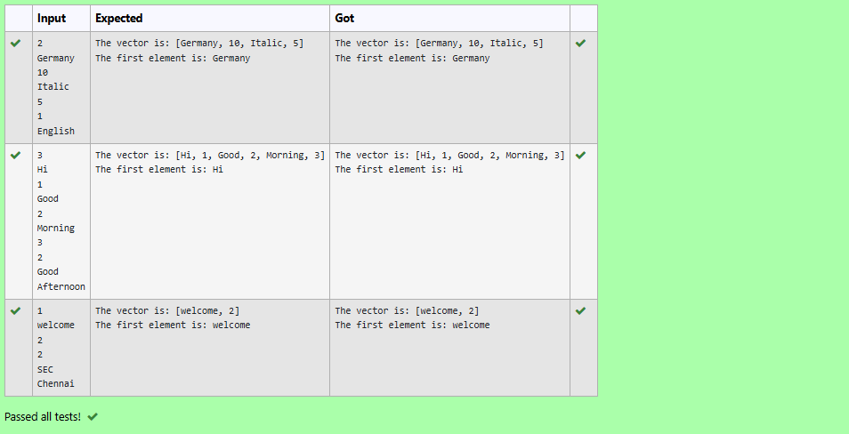

# Ex.No:12(C)             JAVA STACK & VECTOR
 ## AIM :

To add pairs of strings into a Vector, display the vector, and print the first element.
## ALGORITHM :

1. **Create a `Vector<String>`** to store string elements.
2. **Take input `size`** – the number of pairs of strings to be entered.
3. **Use a loop** to input and add two strings per iteration into the vector using `.add()`.
4. **Display the complete vector** using `System.out.println()`.
5. **Retrieve and print the first element** using `.firstElement()`.

## PROGRAM:
 ```
/*
Program to implement a JAVA STACK & VECTOR  using Java
Developed by: Muhammad Afshan A
RegisterNumber: 212223100035*/
```
## SOURCECODE.JAVA:

```
import java.util.*;

public class VectorDemo {
	public static void main(String args[])
	{

		
		Vector<String> vec_tor = new Vector<String>();
        Scanner sc=new Scanner(System.in);
        int size=sc.nextInt();
	    for(int i=0;i<size;i++)
	    {
		vec_tor.add(sc.next());
	    vec_tor.add(sc.next());
	    }
	

		System.out.println("The vector is: " + vec_tor);

	    System.out.println("The first element is: "
                           + vec_tor.firstElement());
	}
}


```


## OUTPUT:



## RESULT:

Thus the java program To add pairs of strings into a Vector, display the vector, and print the first element executed successfully.


