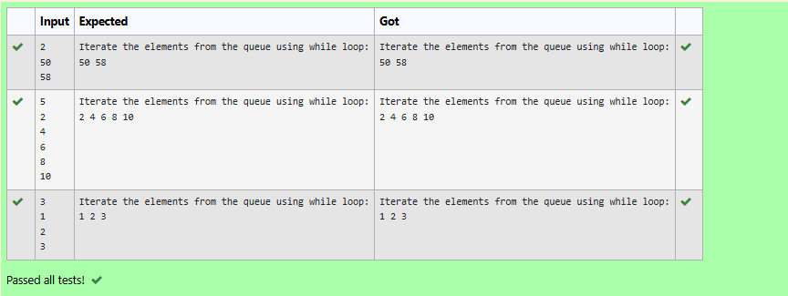

# Ex.No:12(D) JAVA QUEUE
## AIM:
To add integers into a PriorityQueue and iterate over the elements using an iterator.

## ALGORITHM :


1. **Create a `PriorityQueue<Integer>`** to hold integer elements with natural ordering.
2. **Take input `size`** – the number of integers to add.
3. **Use a loop** to read integers from the user and add them to the priority queue.
4. **Create an iterator** for the priority queue using `.iterator()`.
5. **Iterate and print all elements** using the iterator’s `hasNext()` and `next()` methods.


## PROGRAM:
 ```
/*
Program to implement a JAVA QUEUE using Java
Developed by: Muhammad Afshan A
RegisterNumber: 212223100035*/
```
## SOURCECODE.JAVA:

```
import java.util.*;

public class PriorityQueueDemo {
	

	public static void main(String args[])
	{
	
		PriorityQueue<Integer> pQueue = new PriorityQueue<Integer>();
        
	    Scanner sc=new Scanner(System.in);
	    int size=sc.nextInt();
	    for(int i=0;i<size;i++){
	        pQueue.add(sc.nextInt());
	    }
	   Iterator iterator = pQueue.iterator();
	   System.out.println("Iterate the elements from the queue using while loop:");
  
        while (iterator.hasNext()) {
            System.out.print(iterator.next() + " ");
        }
		
	}
}


```
## OUTPUT:


## RESULT:
Thus the java program To add integers into a PriorityQueue and iterate over the elements using an iterator executed successfully.


