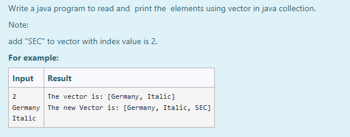
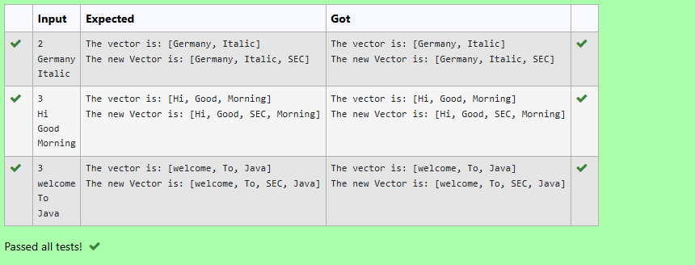

# Ex.No:12(E) JAVA VECTOR IMPLEMENTATION

## AIM:
To write a Java program to read and print the elements using Vector in Java Collection.
*Note: Add `"SEC"` to vector at index value 2.*

## ALGORITHM:
1. Start
2. Import `java.util.*`
3. Define class `VectorExample` with `main` method:

   * a) Initialize `Scanner` and a `Vector<String>`
   * b) Read integer `n`
   * c) Loop `n` times to add elements to the vector
4. Display the original vector
5. Insert `"SEC"` at index 2 using `add(index, element)`
6. Display the updated vector
7. End

## PROGRAM:
```
/*
Program to implement a JAVA VECTOR using Java
Developed by: Muhammad Afshan A
RegisterNumber: 212223100035
*/
```

## PROGRAM QUESTION AND SAMPLE INPUT:


## SOURCECODE.JAVA:

```
import java.util.*;

public class VectorExample {
    public static void main(String[] args) {
        Scanner sc = new Scanner(System.in);
        Vector<String> vector = new Vector<>();

        int n = sc.nextInt();
        for (int i = 0; i < n; i++) {
            vector.add(sc.next());
        }

        System.out.println("The vector is: " + vector);
        vector.add(2, "SEC");
        System.out.println("The new Vector is: " + vector);
    }
}
```

## OUTPUT:


## RESULT:
Thus the Java program to insert and print elements using Vector and add a value at a specific index was executed and verified successfully.
